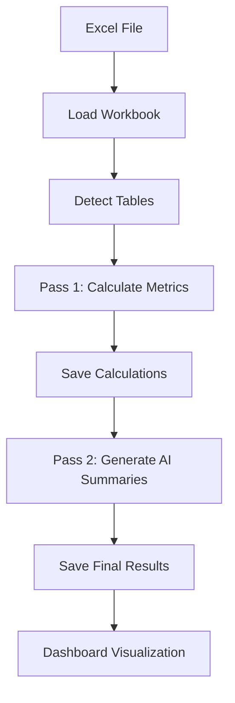

# Traffic Analysis Agent with AI-Powered Insights

An intelligent Excel analytics system that processes traffic and session data with AI-powered summaries and interactive visualizations. This project combines automated data processing with LLM-based analysis to provide comprehensive insights into web traffic trends.

##  Features

- **Automated Excel Processing**: Automatically detects and processes multiple data tables in Excel workbooks
- **AI-Powered Analysis**: Generates intelligent summaries using OpenRouter API with DeepSeek models
- **Multi-Agent Workflow**: LangGraph integration for sophisticated data processing pipelines
- **Interactive Dashboard**: Real-time visualization with Dash and Plotly
- **Comprehensive Metrics**: Year-over-Year (YOY) and Month-over-Month (MoM) calculations
- **Smart Data Parsing**: Robust table boundary detection and data extraction

##  Table of Contents

- [Installation](#installation)
- [Project Structure](#project-structure)
- [Usage](#usage)
- [Features in Detail](#features-in-detail)
- [Configuration](#configuration)
- [API Integration](#api-integration)

##  Installation

### Prerequisites

- Python 3.8 or higher
- pip package manager

### Setup

1. Clone or download this repository

2. Install required dependencies:
```bash
pip install -r requirements.txt
```

3. Set up your OpenRouter API key in `.env` file:
```
OPENROUTER_API_KEY=your_api_key_here
```

##  Project Structure

```
llm_excel_summary_final/
├── langraph.py              # LangGraph-based multi-agent workflow
├── process_excel.py         # Core Excel processing and AI summary generation
├── dashboard.py             # Interactive Dash dashboard
├── keywords.xlsx            # Input Excel file with traffic data
├── requirements.txt         # Python dependencies
├── .env                     # Environment variables (API keys)
└── README.md               # This file
```

##  Usage

### 1. Process Excel Data with AI Summaries

Run the LangGraph-based processor (recommended):

```bash
python langraph.py
```

Or use the standard processor:

```bash
python process_excel.py
```

This will:
- Read `keywords.xlsx` from the current directory
- Detect all data tables in the "Traffic-Status" sheet
- Calculate totals, YOY%, and MoM% for each table
- Generate AI-powered summaries for each table
- Save results back to `keywords.xlsx`

### 2. Launch Interactive Dashboard

```bash
python dashboard.py
```

Access the dashboard at: `http://127.0.0.1:8050`

The dashboard provides:
- Table selection dropdown
- Key metrics cards (Total 2024, Total 2025, YOY Change)
- Traffic trend charts
- Year-over-Year comparison charts
- Month-over-Month change visualization
- Monthly data table
- AI-generated insights panel

##  Features in Detail

### Excel Processing (`process_excel.py` & `langraph.py`)

**Two-Pass Processing:**

1. **Pass 1: Calculations**
   - Detects table boundaries automatically
   - Calculates monthly totals
   - Computes Year-over-Year percentage changes
   - Computes Month-over-Month percentage changes
   - Formats cells with proper number formatting

2. **Pass 2: AI Summaries**
   - Generates comprehensive summaries using OpenRouter API
   - Analyzes trends, patterns, and anomalies
   - Provides actionable insights
   - Writes summaries to column H in Excel

**Key Functions:**

- `find_table_boundaries()`: Automatically detects table structure
- `calculate_with_openrouter()`: Performs calculations with optional AI validation
- `generate_table_summary()`: Creates AI-powered analytical summaries
- `safe_float()`: Robust data type conversion

### LangGraph Integration (`langraph.py`)

Implements a multi-agent workflow using LangGraph:

- **State Management**: TypedDict-based state tracking
- **Graph Structure**: Sequential processing nodes
- **Modular Design**: Clean separation of concerns
- **Error Handling**: Robust exception management

### Interactive Dashboard (`dashboard.py`)

Built with Dash and Plotly for real-time visualization:

**Components:**
- **Metrics Cards**: Display key performance indicators
- **Traffic Trend Chart**: Multi-year line chart with markers
- **YOY Comparison**: Color-coded bar chart (green for growth, red for decline)
- **MoM Change Chart**: Month-over-month percentage changes
- **Data Table**: Formatted monthly data with styling
- **AI Insights Panel**: Scrollable summary display

**Features:**
- Responsive layout
- Interactive tooltips
- Dynamic table selection
- Professional color scheme
- Auto-refresh capability

##  Configuration

### OpenRouter API Settings

Edit the API configuration in `process_excel.py` or `langraph.py`:

```python
API_KEY = "your-api-key-here"
API_URL = "https://openrouter.ai/api/v1/chat/completions"
MODEL = "tngtech/deepseek-r1t2-chimera:free"
```

### Toggle AI Processing

To disable OpenRouter API calls (faster processing):

```python
USE_OPENROUTER = False  # Set to True to enable AI validation
```

### Dashboard Customization

Modify colors in `dashboard.py`:

```python
colors = {
    'background': '#f8f9fa',
    'text': '#2c3e50',
    'primary': '#3498db',
    'secondary': '#2ecc71',
    'accent': '#e74c3c',
    'card': '#ffffff'
}
```

##  API Integration

### OpenRouter API

This project uses OpenRouter for AI-powered analysis:

- **Model**: DeepSeek R1T2 Chimera (free tier)
- **Purpose**: Generate analytical summaries and validate calculations
- **Rate Limits**: Depends on your OpenRouter plan
- **Timeout**: 60 seconds per request

### API Prompts

**For Summaries:**
- System: Expert data analyst specializing in traffic analysis
- Temperature: 0.3 (balanced creativity and consistency)
- Max Tokens: 700

**For Calculations:**
- System: Mathematical calculation assistant
- Temperature: 0.2 (high precision)
- Max Tokens: 500

##  Data Format

The Excel file should have a "Traffic-Status" sheet with tables in this format:

```
[Table Title]
Month       | 2023    | 2024    | 2025    | YOY %  | LM %   | AI Summary
------------|---------|---------|---------|--------|--------|------------
Jan         | 5,288   | 4,892   | 3,892   | -20.4% | -      | [Generated]
Feb         | 5,500   | 5,100   | 3,977   | -22.0% | 2.18%  | [Generated]
...
Total       | 65,000  | 60,000  | 48,000  | -20.0% | -      |
```

##  Technical Details

### Calculation Formulas

**Year-over-Year (YOY) %:**
```
YOY % = ((Sessions 2025 - Sessions 2024) / Sessions 2024) × 100
```

**Month-over-Month (MoM) %:**
```
MoM % = ((Current Month - Previous Month) / Previous Month) × 100
```

### Dependencies

- `pandas>=2.0.0` - Data manipulation
- `openpyxl>=3.1.0` - Excel file handling
- `requests>=2.31.0` - API calls
- `dash>=2.14.0` - Web dashboard framework
- `plotly>=5.17.0` - Interactive visualizations
- `langgraph>=0.0.20` - Multi-agent workflow
- `langchain-core>=0.1.0` - LangChain integration
- `typing-extensions>=4.8.0` - Type hints

##  Use Cases

1. **Marketing Analytics**: Track website traffic trends and campaign performance
2. **Business Intelligence**: Monitor session data and user engagement
3. **Performance Reporting**: Generate automated reports with AI insights
4. **Trend Analysis**: Identify seasonal patterns and anomalies
5. **Executive Dashboards**: Present data visually with key metrics

##  Workflow



##  Notes

- The system automatically detects table boundaries based on "Month" headers
- Summaries are generated in plain text without markdown formatting
- The dashboard auto-refreshes when you select different tables
- All calculations are performed locally with optional AI validation
- Excel formulas in the original file are preserved

##  Contributing

This is a standalone analytics tool. Feel free to customize it for your specific needs.

##  License

This project is provided as-is for analytical and educational purposes.

##  Troubleshooting

**Issue: API timeout errors**
- Solution: Increase timeout value or set `USE_OPENROUTER = False`

**Issue: Table not detected**
- Solution: Ensure table has "Month" in column B header row

**Issue: Dashboard not loading**
- Solution: Check that `keywords.xlsx` exists and has "Traffic-Status" sheet

**Issue: Missing summaries**
- Solution: Verify OpenRouter API key is valid and has available credits

##  Support

For issues or questions, check the code comments or review the inline documentation in each Python file.

---

**Built with  using Python, LangGraph, Dash, and AI**
